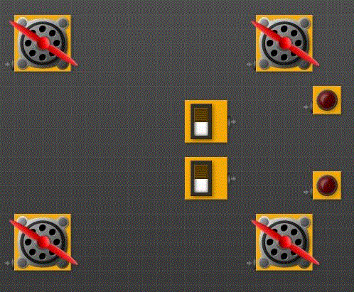

# The Logic Lab Assignment
Mirror location for The Logic Lab serving as a backup. Mirror site located at:https://mariopineda.github.io/TLL-Assignment/
All credits go to Kris Temmerman's original located at: http://www.neuroproductions.be/logic-lab/

In this Assignment you will be learning about logic gates by creating virtual circuits.

## Research
Read up on logic gates: https://en.wikipedia.org/wiki/Logic_gate
Watch the following video about logica gates: https://youtu.be/gI-qXk7XojA

## Step 1: Set Up
On the Logic Lab site (link above), set up a car with 4 wheels, a brake pedal, a gas pedal and two turn signals (on the front of the 
car).  The following is one possible starting layout.

Assume the top pedal is the brake.  The bottom is the gas.

# Challenge #1:  Gas and Brake
Program the car with the following features:
- when the gas pedal is pressed (bottom switch), all four wheels start to spin (unless the brake is also pressed)
- when the brake is pressed, all four wheels will be stopped
- when the brake and gas is pressed, the engine should just rev (in other words, all four wheels will be stopped)

# Challenge #2: Turning
Turning will be indicated by having only 2 of the wheels spinning (like for a tank) and the appropriate light is on or flashing. Turning left will mean the top two wheels will be stopped. Turning right will mean the bottom two wheels will be stopped.  Add two RED BUTTONS to indicate a left and right turn signal (press the left to turn left).  Then program the car with the following features:
- when the gas pedal is pressed AND the right turn signal is on, the car will turn right
- when the gas pedal is pressed AND the left turn signal is on, the car will turn left if the gas pedal is not pressed, the turn signals will not do anything add brake lights

# Extra challenges:
Here are some fun things to try:
- add a bumper that will turn off the engine in the event of a crash
- add a speedometer. Use multiple switches to represent how far down you are pressing the gas pedal and then wire in the counter to show your speed.
- add whatever else you can think of
